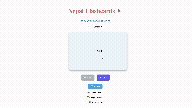

# Web Development Project 3 - *Nepal Flashcards 🇳🇵*

Submitted by: **Bigyan Timalsina**

This web app: **is an interactive flashcard application that helps users learn fun and educational facts about Nepal. Users can guess answers, flip cards, track streaks, and even shuffle or master cards as they study.**

Time spent: **X hours spent in total**

---

## Required Features

The following **required** functionality is completed:

- [x] **The user can enter their guess into an input box *before* seeing the flipside of the card**
  - Application features a clearly labeled input box with a submit button where users can type in a guess  
  - Clicking on the submit button with an **incorrect** answer shows visual feedback that it is wrong  
  - Clicking on the submit button with a **correct** answer shows visual feedback that it is correct  

- [x] **The user can navigate through an ordered list of cards**
  - A forward/next button displayed on the card navigates to the next card in a set sequence when clicked  
  - A previous/back button displayed on the card returns to the previous card in the set sequence when clicked  
  - Both the next and back buttons have visual indication that the user is at the beginning or end of the list (buttons are disabled and grayed out), not allowing for wrap-around navigation  

---

## Optional Features

The following **optional** features are implemented:

- [x] Users can use a shuffle button to randomize the order of the cards  
  - Cards remain in the same sequence (**NOT** randomized) unless the shuffle button is clicked  
  - Cards change to a random sequence once the shuffle button is clicked  

- [x] A user’s answer may be counted as correct even when it is slightly different from the target answer  
  - Answers are considered correct even if they only partially match the answer on the card  
  - Examples: ignoring uppercase/lowercase discrepancies, ignoring punctuation discrepancies, matching only for a particular part of the answer rather than the whole answer  

- [x] A counter displays the user’s current and longest streak of correct responses  
  - The current counter increments when a user guesses an answer correctly  
  - The current counter resets to 0 when a user guesses an answer incorrectly  
  - A separate counter tracks the longest streak, updating if the value of the current streak counter exceeds the value of the longest streak counter  

- [x] A user can mark a card that they have mastered and have it removed from the pool of displayed cards  
  - The user can mark a card to indicate that it has been mastered  
  - Mastered cards are removed from the pool of displayed cards and added to a list of mastered cards  

---

## Additional Features

* [x] **Dynamic background video** adds a visually appealing learning experience  
* [x] **Animated card flipping** for immersive user interaction  
* [x] **Color-coded cards** for better visual organization  
* [x] **Responsive feedback styling** on input boxes based on correctness  

---

## Video Walkthrough

Here's a walkthrough of implemented user stories:

GIF created with **Kap** (for macOS)

---

## Notes

Challenges encountered while building the app:
- Managing multiple state variables (`currentIndex`, `feedback`, `streaks`, `masteredCards`) simultaneously in React.  
- Implementing clean navigation without allowing wrap-around behavior.  
- Styling and synchronizing animations (flip + video background) smoothly.

---

## License

    Copyright 2025 Bigyan Timalsina

    Licensed under the Apache License, Version 2.0 (the "License");
    you may not use this file except in compliance with the License.
    You may obtain a copy of the License at

        http://www.apache.org/licenses/LICENSE-2.0

    Unless required by applicable law or agreed to in writing, software
    distributed under the License is distributed on an "AS IS" BASIS,
    WITHOUT WARRANTIES OR CONDITIONS OF ANY KIND, either express or implied.
    See the License for the specific language governing permissions and
    limitations under the License.
